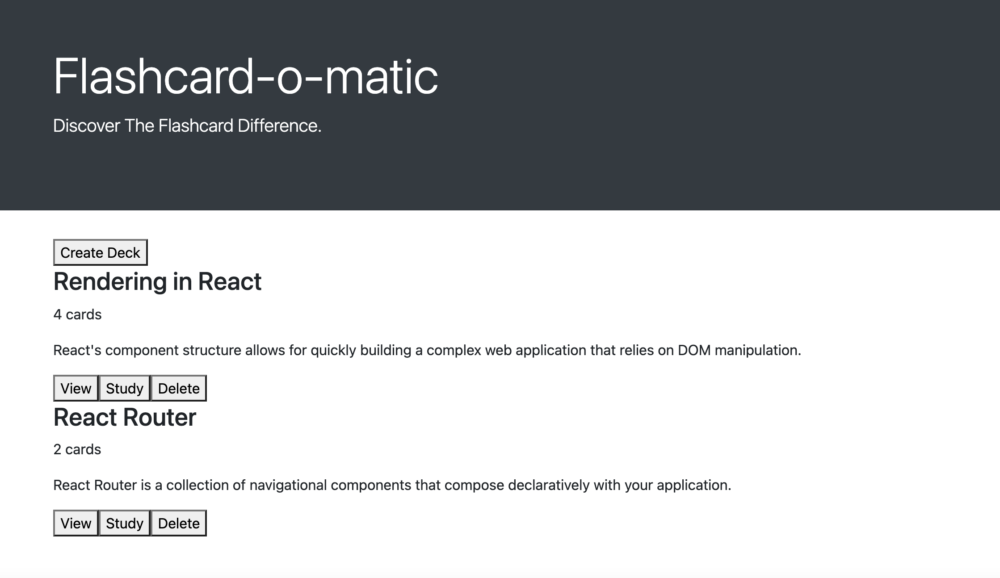
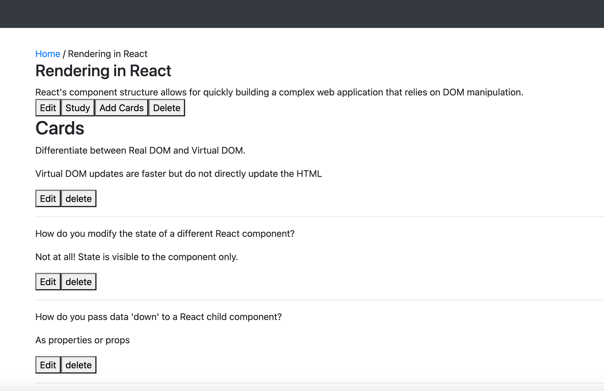
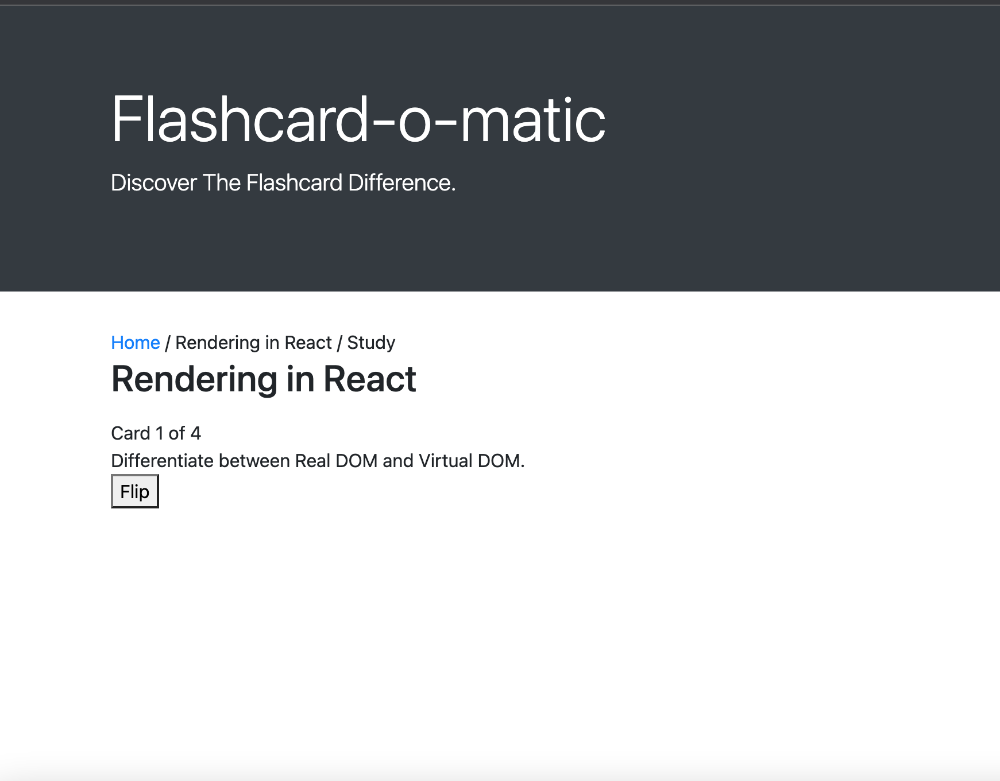
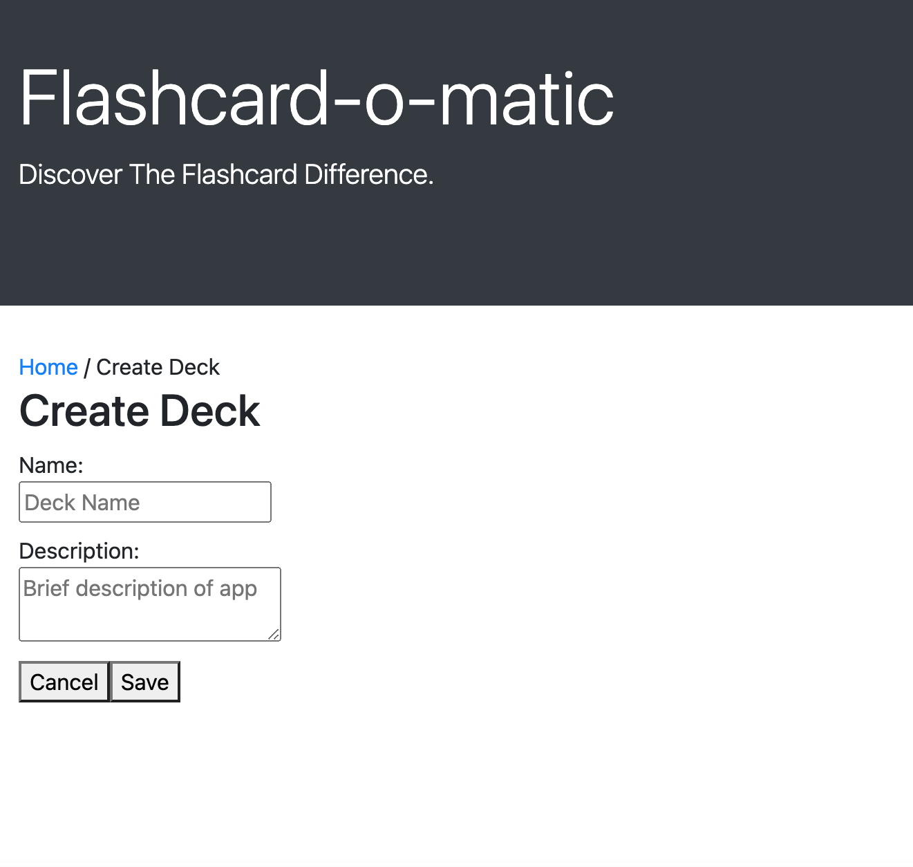

# FlashCards

Flash cards is a Thinkful project to help students study,

This app allows users to create and store multiple decks into the json database. Allowing you to study practically
anything you normally would with flashcards while being able to organize them into one app

### Home page

### Deck details

### Studying

### Creating Decks

